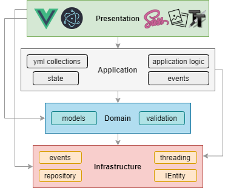
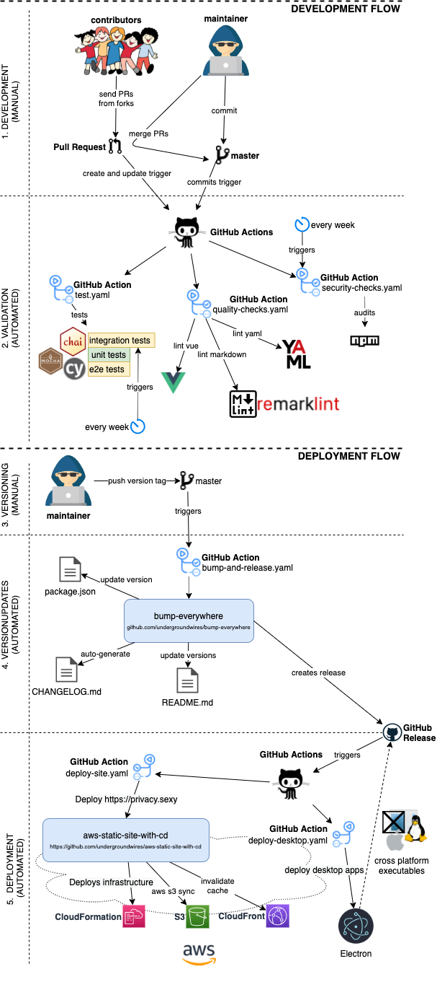

# privacy.sexy

> Enforce privacy & security best-practices on Windows and macOS, because privacy is sexy 🍑🍆

## Get started

- Online version at [https://privacy.sexy](https://privacy.sexy)
  - 💡 No need to run any compiled software on your computer.
- Alternatively download offline version for [Windows](https://github.com/undergroundwires/privacy.sexy/releases/download/0.11.1/privacy.sexy-Setup-0.11.1.exe), [macOS](https://github.com/undergroundwires/privacy.sexy/releases/download/0.11.1/privacy.sexy-0.11.1.dmg) or [Linux](https://github.com/undergroundwires/privacy.sexy/releases/download/0.11.1/privacy.sexy-0.11.1.AppImage).
  - 💡 Single click to execute your script.
- ❗ Come back regularly to apply latest version for stronger privacy and security.

## Why

- Rich tweak pool to harden security & privacy of the OS and other software on it
- Free (both free as in beer and free as in speech)
- No need to run any compiled software that has access to your system, just run the generated scripts
- Have full visibility into what the tweaks do as you enable them
- Ability to revert (undo) applied scripts
- Everything is transparent: both application and its infrastructure are open-source and automated
- Easily extendable with [own powerful templating language](./docs/templating.md)
- Each script is independently executable without cross-dependencies

## Extend scripts

- You can either [create an issue](https://github.com/undergroundwires/privacy.sexy/issues/new/choose)
- Or send a PR:
  1. Fork the repository
  2. Add more scripts in respective script collection in [collections](src/application/collections/) folder.
     - 📖 If you're unsure about the syntax you can refer to the [collection files | documentation](docs/collection-files.md).
     - 🙏 For any new script, please add `revertCode` and `docs` values if possible.
  3. Send a pull request 👌

## Commands

- Project setup: `npm install`
- Testing
  - Run unit tests: `npm run test:unit`
  - Run integration tests: `npm run test:integration`
  - Lint: `npm run lint`
- **Desktop app**
  - Development: `npm run electron:serve`
  - Production: `npm run electron:build` to build an executable
- **Webpage**
  - Development: `npm run serve` to compile & hot-reload for development.
  - Production: `npm run build` to prepare files for distribution.
  - Or run using Docker:
    1. Build: `docker build -t undergroundwires/privacy.sexy:0.11.1 .`
    2. Run: `docker run -it -p 8080:80 --rm --name privacy.sexy-0.11.1 undergroundwires/privacy.sexy:0.11.1`

## Architecture overview

### Application

- Powered by **TypeScript**, **Vue.js** and **Electron** 💪
  - and driven by **Domain-driven design**, **Event-driven architecture**, **Data-driven programming** concepts.
- Application uses highly decoupled models & services in different DDD layers.
- 📖 Read more on • [Presentation](./docs/presentation.md) • [Application](./docs/application.md)

### AWS Infrastructure

- It uses infrastructure from the following repository: [aws-static-site-with-cd](https://github.com/undergroundwires/aws-static-site-with-cd)
  - Runs on AWS 100% serverless and automatically provisioned using [GitHub Actions](.github/workflows/).
  - Maximum security & automation and minimum AWS costs are the highest priorities of the design.

#### GitOps: CI/CD to AWS

- CI/CD is fully automated for this repo using different GIT events & GitHub actions.
  - Versioning, tagging, creation of `CHANGELOG.md` and releasing is automated using [bump-everywhere](https://github.com/undergroundwires/bump-everywhere) action
- Everything that's merged in the master goes directly to production.

