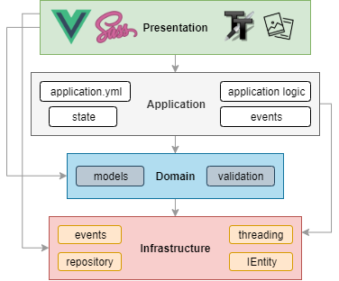
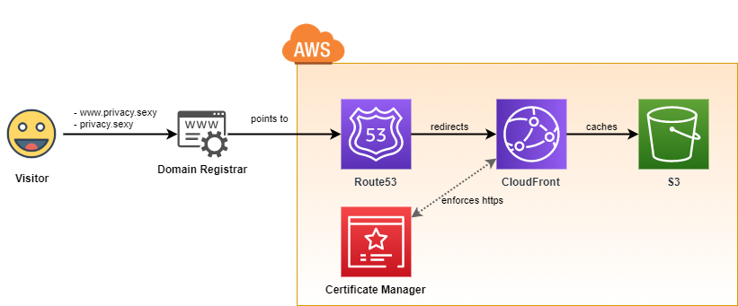
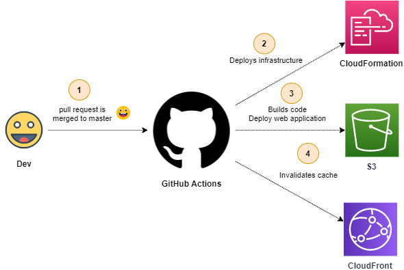
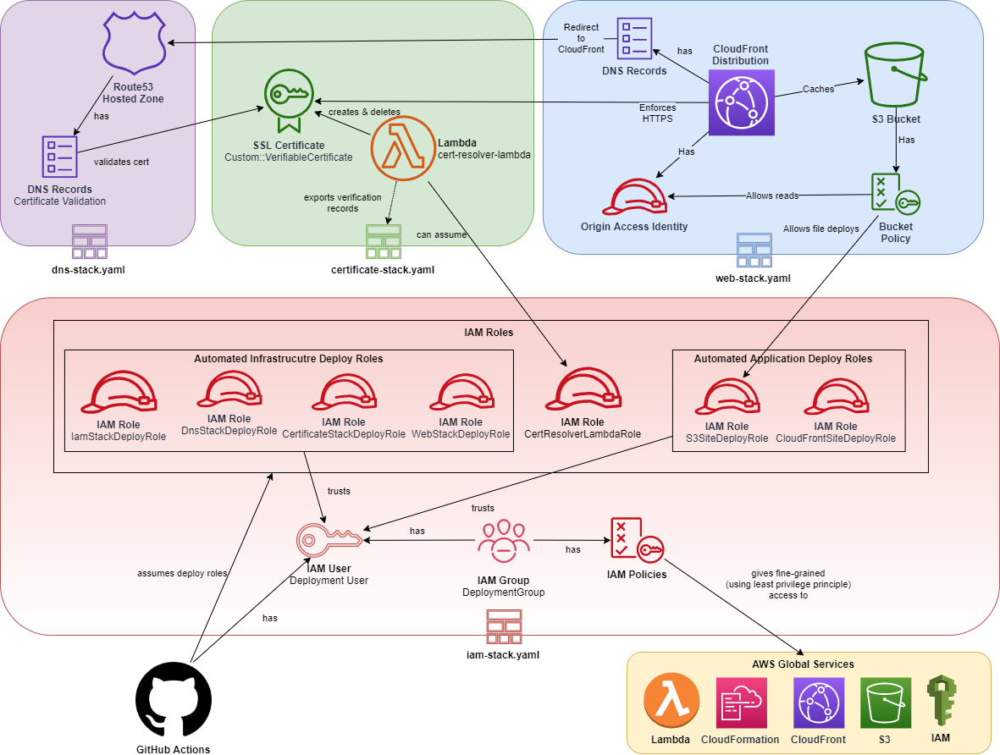

# privacy.sexy

Web tool to generate scripts for enforcing privacy & security best-practices such as stopping data collection of Windows and different softwares on it.
> because privacy is sexy 🍑🍆

[https://privacy.sexy](https://privacy.sexy)

## Why privacy.sexy

- You don't need to run any compiled software on your system, just run the generated scripts.
- It's open source, both application & infrastructure is 100% transparent
  - Fully automated C/CD pipeline to AWS for provisioning serverless infrastructure using GitHub actions.
- Have full visibility into what the tweaks do as you enable them.
- Easily extendable

## Extend scripts

Fork it & add more scripts in `src/application/application.yml` and send a pull request 👌

## Commands

- Setup and run
  - For development:
    - `npm install` to project setup.
    - `npm run serve` to compile & hot-reload for development.
  - Production (using Docker):
    - Build `docker build -t undergroundwires/privacy.sexy .`
    - Run `docker run -it -p 8080:8080 --rm --name privacy.sexy-1 undergroundwires/privacy.sexy`
- Prepare for production: `npm run build`
- Run tests: `npm run test:unit`
- Lint and fix files: `npm run lint`

## Architecture

### Application

- Powered by **TypeScript** + **Vue.js** 💪
  - and driven by **Domain-driven design**, **Event-driven architecture**, **Data-driven programming** concepts.
- Application uses highly decoupled models & services in different DDD layers.
  - **Domain layer** is where the application is modelled with validation logic.
  - **Presentation Layer**
    - Consists of Vue.js components & UI stuff.
    - Event driven as in components simply listens to events from the state and act accordingly.
  - **Application Layer**
    - Keeps the application state
      - The [state](src/application/State/ApplicationState.ts) is a mutable singleton & event producer.
    - The application is defined & controlled in a [single YAML file](`\application\application.yaml`) (see [Data-driven programming](https://en.wikipedia.org/wiki/Data-driven_programming))

### AWS Infrastructure

- The application runs in AWS 100% serverless and automatically provisioned using [CloudFormation files](/aws) and GitHub Actions.
- Maximum security & automation and minimum AWS costs were the highest priorities of the design.

#### GitOps: CI/CD to AWS

- Everything that's merged in the master goes directly to production.
  - Deploy infrastructure ► Deploy web application ► Invalidate CloudFront Cache
- See more at [build-and-deploy.yaml](.GitHub/workflows/build-and-deploy.yaml)

##### CloudFormation

- AWS infrastructure is defined as code with following files:
  - `iam-stack`: Creates & updates the deployment user.
    - Everything in IAM layer is fine-grained using least privileges principle.
    - Each deployment step has its own temporary credentials with own permissions.
  - `certificate-stack.yaml`
    - It'll generate SSL certification for the root domain and www subdomain.
    - ❗ It [must](https://aws.amazon.com/premiumsupport/knowledge-center/cloudfront-invalid-viewer-certificate/) be deployed in `us-east-1` to be able to be used by CloudFront by `web-stack`.
    - It uses CustomResource and a lambda instead of native `AWS::CertificateManager::Certificate` because:
      - Problem:
        - AWS variant waits until a certificate is validated.
        - There's no way to automate validation without workaround.
      - Solution:
        - Deploy a lambda that deploys the certificate (so we don't wait until certificate is validated)
        - Get DNS records to be used in validation & export it to be used later.
  - `web-stack.yaml`: It'll deploy S3 bucket and CloudFront in front of it.
  - `dns-stack.yaml`: It'll deploy Route53 hosted zone
    - Each time Route53 hosted zone is re-created it's required to update the DNS records in the domain registrar. See *Configure your domain registrar*.
- I use cross stacks instead of single stack or nested stacks because:
  - Easier to test & maintain & smaller files and different lifecycles for different areas.
  - It allows to deploy web bucket in different region than others as other stacks are global (`us-east-1`) resources.

##### Initial deployment

- ❗ Prerequisite: A registered domain name for website.

1. **Configure build agent (GitHub actions)**
   - Deploy manually `iam-stack.yaml` with stack name `privacysexy-iam-stack` (to follow the convention)
     - It'll give you deploy user. Go to console &  generate secret id + key (Security credentials => Create access key) for the user [IAM users](https://console.aws.amazon.com/iam/home#/users).
       - 🚶 Deploy secrets:
         - Add secret id & key in GitHub Secrets.
           - `AWS_DEPLOYMENT_USER_ACCESS_KEY_ID`, `AWS_DEPLOYMENT_USER_SECRET_ACCESS_KEY`
         - Add more secrets given from Outputs section of the CloudFormation stack.
     - Run GitHub actions to deploy rest of the application.
       - It'll run `certificate-stack.yaml` and then `iam-stack.yaml`.

2. **Configure your domain registrar**
   - ❗ **Web stack will fail** after DNS stack because you need to validate your domain.
   - 🚶 Go to your domain registrar and change name servers to NS values
     - `dns-stack.yaml` outputs those in CloudFormation stack.
     - You can alternatively find those in [Route53](https://console.aws.amazon.com/route53/home#hosted-zones)
   - When nameservers of your domain updated, the certification will get validated automatically, you can then delete the failed stack in CloudFormation & re-run the GitHub actions.

## Thank you for the awesome projects 🍺

- [Vue.js](https://vuejs.org/) the only big JavaScript framework that's not backed by companies that make money off your data.
- [liquor-tree](https://GitHub.com/amsik/liquor-tree) for the awesome & super extensible tree component.
- [Ace](https://ace.c9.io/) for code box.
- [FileSaver.js](https://GitHub.com/eligrey/FileSaver.js) for save file dialog.
- [chai](https://GitHub.com/chaijs/chai) & [mocha](https://GitHub.com/mochajs/mocha) for making testing fun.
- [js-yaml-loader](https://GitHub.com/wwilsman/js-yaml-loader) for ahead of time loading `application.yml`
- [v-tooltip](https://GitHub.com/Akryum/v-tooltip) takes seconds to have a tooltip, exactly what I needed.
