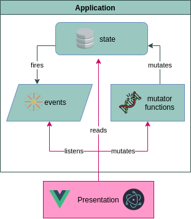

# Architecture overview

This repository consists of:

- A [layered application](#layered-application).
- [AWS infrastructure](#aws-infrastructure) as code and instructions to host the website.
- [GitOps](#gitops) practices for development, maintenance and deployment.

## Layered application

Application is

- powered by **TypeScript**, **Vue.js** and **Electron** 💪,
- and driven by **Domain-driven design**, **Event-driven architecture**, **Data-driven programming** concepts.

Application uses highly decoupled models & services in different DDD layers:

- presentation layer (see [presentation.md](./presentation.md)),
- application layer (see [application.md](./application.md)),
- and domain layer.

Application layer depends on and consumes domain layer. [Presentation layer](./presentation.md) consumes and depends on application layer along with domain layer. Application and presentation layers can communicate through domain model.

### Application state

State handling uses an event-driven subscription model to signal state changes and special functions to register changes. It does not depend on third party packages.

Each layer treat application layer differently.

*[Presentation layer](./presentation.md)*:

- Each component holds their own state about presentation-related data.
- Components register shared state changes into application state using functions.
- Components listen to shared state changes using event subscriptions.
- 📖 Read more: [presentation.md | Application state](./presentation.md#application-state).

*[Application layer](./application.md)*:

- Stores the application-specific state.
- The state it exposed for read with getter functions and set using setter functions, setter functions also fire application events that allows other parts of application and the view in presentation layer to react.
- So state is mutable, and fires related events when mutated.
- 📖 Read more: [application.md | Application state](./application.md#application-state).

It's comparable with flux ([`redux`](https://redux.js.org/)) or flux-like ([`vuex`](https://vuex.vuejs.org/)) patterns. Flux component "view" is [presentation layer](./presentation.md) in Vue. Flux functions "dispatcher", "store" and "action creation" functions lie in the [application layer](./application.md). A difference is that application state in privacy.sexy is mutable and lies in single flux "store" that holds app state and logic. The "actions" mutate the state directly which in turns act as dispatcher to notify its own event subscriptions (callbacks).

## AWS infrastructure

The web-site runs on serverless AWS infrastructure. Infrastructure is open-source and deployed as code. [aws-static-site-with-cd](https://github.com/undergroundwires/aws-static-site-with-cd) project includes the source code.

The design priorities highest security then minimizing cloud infrastructure costs.

This project includes [GitHub Actions](../.github/workflows/) to automatically provision the infrastructure with zero-touch and without any "hidden" steps, ensuring everything is open-source and transparent. Git repositories includes all necessary instructions and automation with [GitOps](#gitops) practices.

## GitOps

CI/CD is fully automated using different Git events and GitHub actions. This repository uses [bump-everywhere](https://github.com/undergroundwires/bump-everywhere) to automate versioning, tagging, creation of [`CHANGELOG.md`](./../CHANGELOG.md) and GitHub releases. A dedicated [workflow](./../.github/workflows/release.desktop.yaml) creates desktop installers and executables and attaches them into GitHub releases.

Everything that's merged in the master goes directly to production.

📖 Refer to [ci-cd.md](./ci-cd.md) to read more on CI/CD pipelines.

